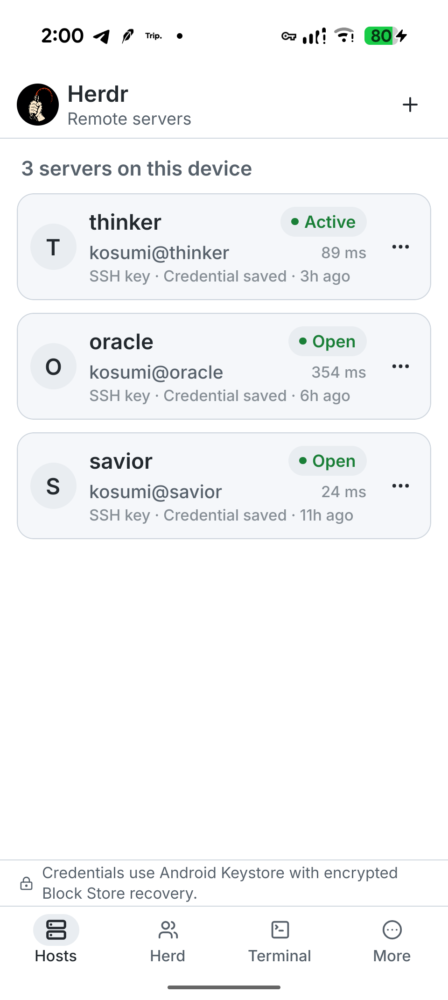
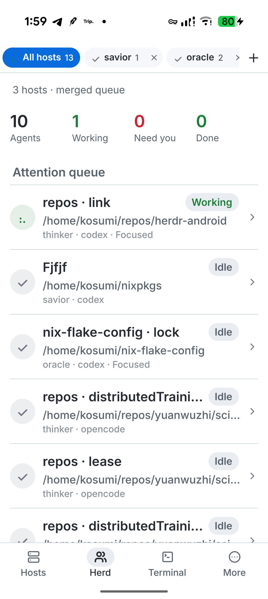
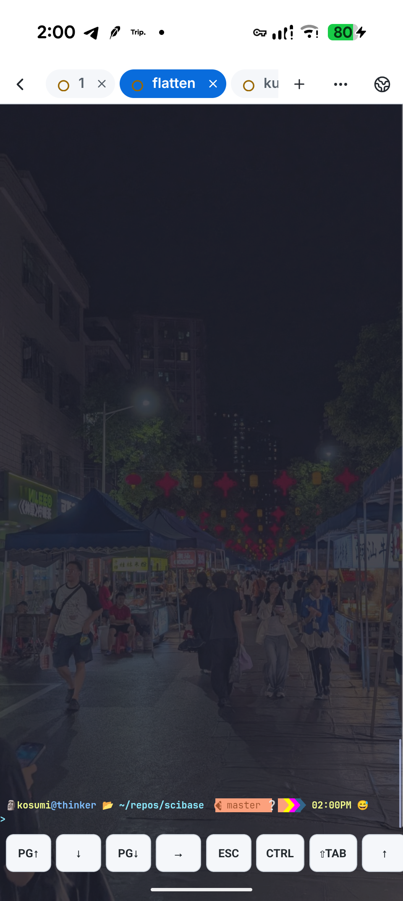
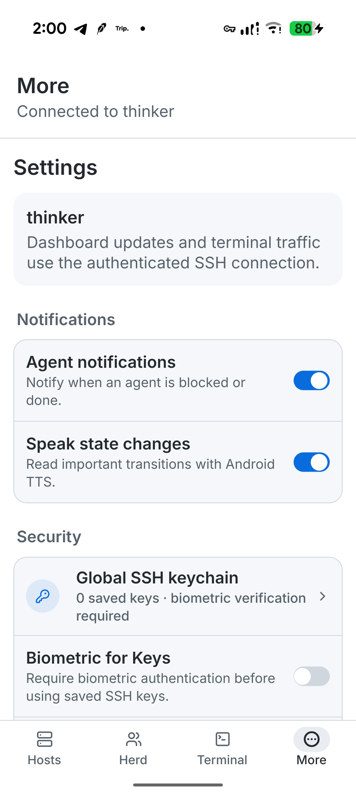

# Whip

<p align="center">
  
</p>

<p align="center">
  <strong>Keep your Herdr agents within reach.</strong><br>
  An independent Android client for supervising agents, scoping hosts and spaces, and opening pane terminals over SSH.
</p>

<p align="center">
  <a href="https://github.com/KaminariOS/whip/actions/workflows/ci.yml"></a>
  <a href="https://github.com/KaminariOS/whip/actions/workflows/codeql.yml"></a>
</p>

Whip gives [Herdr](https://github.com/ogulcancelik/herdr) a touch-friendly Android interface without exposing Herdr itself to the network or requiring changes on the host. It connects directly to your machine over SSH—ideally through Tailscale—and rebuilds the management experience as native screens. A terminal appears only when you choose to attach to a pane.

The app separates connection management from daily supervision: **Hosts** manages saved SSH endpoints, **Herd** merges their agents into a scoped attention queue, **Terminal** lists open pane sessions, and **More** holds notification, appearance, and terminal preferences.

Whip is not developed, maintained, or endorsed by the Herdr project or its authors.

> [!WARNING]
> Whip is an experimental personal project developed for my own needs. I do not know React Native, and I have not read or manually reviewed the generated code. Do not assume the app is secure; review it yourself before trusting it with sensitive systems or credentials. Connect only through a trusted Tailnet because SSH host keys are not yet verified.

## Preview

<table>
  <tr>
    <td align="center"></td>
    <td align="center"></td>
  </tr>
  <tr>
    <td align="center"><strong>Manage every host</strong><br>See live connection state, latency, and saved authentication at a glance.</td>
    <td align="center"><strong>Watch the whole herd</strong><br>Merge open hosts into one attention queue, then scope it to a host or space.</td>
  </tr>
  <tr>
    <td align="center"></td>
    <td align="center"></td>
  </tr>
  <tr>
    <td align="center"><strong>Work from anywhere</strong><br>Open a selected pane in the full-width terminal, then collect its web links in one tap.</td>
    <td align="center"><strong>Tune your workflow</strong><br>Configure agent alerts, speech, security, appearance, and terminal behavior.</td>
  </tr>
</table>

Screenshots were captured from the current Whip Android build on a Pixel 9 Pro.

## What you can do

- Monitor every open host in one native attention queue, with per-host and per-space scopes.
- See working, blocked, done, idle, and unknown agents, including their host and space context.
- Move through Herdr hosts, spaces, tabs, panes, and agents without living in a terminal.
- Create, focus, rename, split, zoom, inspect, and close space resources.
- Launch agents, send direct prompts, and send commands or special keys to a pane.
- Attach to any selected pane through an immersive, xterm-compatible terminal.
- Scan terminal scrollback for web links and open local or LAN services in the in-app browser through an on-demand SSH tunnel.
- Use ANSI colors, modifier keys, touch scrolling, Page Up/Down, a position indicator, double-tap Tab, live resizing, and configurable terminal appearance.
- Receive local notifications, vibration, and optional speech when an agent becomes blocked or finishes.
- Save password or private-key credentials with Android Keystore and encrypted, device-authenticated Block Store recovery.
- Keep several named Herdr hosts open and switch between their live sessions.

## Install an experimental preview

Preview APKs are currently ARM64-only prereleases. Their signing identity may change before Whip reaches a stable release, so Android may require you to uninstall an older preview before installing a newer one.

1. Read the [security policy](SECURITY.md) and [privacy notes](PRIVACY.md).
2. Put the Android phone and Herdr host on a Tailnet you trust.
3. Download the APK and checksum from [GitHub Releases](https://github.com/KaminariOS/whip/releases).
4. Verify the download:

   ```bash
   sha256sum -c whip-experimental-arm64.apk.sha256
   ```

5. Allow installation from the app that downloaded the APK, then open Whip.

Whip supports Android 7.0 and newer (`minSdk 24`). The current preview distribution targets 64-bit ARM Android devices.

## Connect your first host

You need an SSH server and Herdr on a laptop or server reachable from the phone. Confirm the same connection outside Whip first:

```bash
ssh user@laptop.tailnet.ts.net 'herdr status server --json'
```

Then in Whip:

1. Tap **Add your first host**.
2. Enter the Tailscale DNS name or `100.x.y.z` address, SSH user, and password or private key.
3. Leave **Command** as `herdr`, or enter its absolute path if it is not in the non-interactive SSH `PATH`.
4. Choose the Herdr session name and connect.

Whip accepts Herdr releases that report protocol 17 and rejects other protocol versions to avoid sending incompatible commands. The **About Whip** screen shows both sides of the active connection.

## How it works

Whip connects directly from Android to the configured SSH host. There is no Whip-operated relay service, and Herdr remains bound to the host as usual.

While Whip is foregrounded, native screens receive workspace, tab, pane, and agent state from Herdr. Actions map to the existing Herdr CLI surfaces. Opening a pane terminal uses Herdr's remote client bridge over the same SSH connection, with live input, resize, and render frames. Links found in terminal scrollback open directly when they are public; loopback and private-network addresses are forwarded through the active SSH connection first.

The current SSH dependency does not pin host keys. Use Whip only over a trusted network until known-host verification is implemented. See [SECURITY.md](SECURITY.md) for the current security posture and [PRIVACY.md](PRIVACY.md) for the data flow and on-device storage details.

## Development

Whip uses Expo SDK 57 with a custom Android development build. It cannot run in Expo Go because SSH, Android Keystore, and the patched PTY stream use native modules.

On NixOS, the included development shell provides Node.js 22, JDK 17, and the required Android SDK and NDK versions:

```bash
nix develop
npm ci
npm run android
```

On other systems, install Node.js 22, JDK 17, Android SDK Platform 36, Build Tools 36.0.0, NDK 27.1.12297006, and CMake 3.22.1. Set `ANDROID_HOME`, then run:

```bash
npm ci
npm run android
```

See [DEBUG.md](DEBUG.md) for the complete emulator and physical-device loop.

### EAS builds

After authenticating and initializing the Expo project:

```bash
npx eas-cli build --profile development --platform android
npx eas-cli build --profile preview --platform android
```

The `development` profile creates an Expo development client. The `preview` profile creates an installable APK.

### Validation

```bash
npx expo-doctor
npx tsc --noEmit
npm run lint
npm test -- --runInBand
npx expo export --platform android
```

The SSH bridge is maintained in [`packages/react-native-ssh-sftp`](packages/react-native-ssh-sftp). The root dependency uses that local package; do not edit or patch its symlink under `node_modules`.

## Community

- Read [CONTRIBUTING.md](CONTRIBUTING.md) before opening a pull request.
- Ask usage and design questions in [GitHub Discussions](https://github.com/KaminariOS/whip/discussions).
- Use the issue forms for reproducible bugs and scoped feature requests.
- Follow the [Code of Conduct](CODE_OF_CONDUCT.md).
- Review the [roadmap](ROADMAP.md) for current priorities.

Feedback is especially useful around Android device compatibility, real-world Herdr workflows, terminal ergonomics, and safe SSH trust UX.

## License

Whip is licensed under the [GNU Affero General Public License v3.0 or later](LICENSE).
