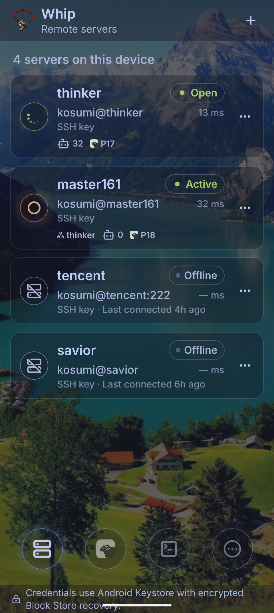
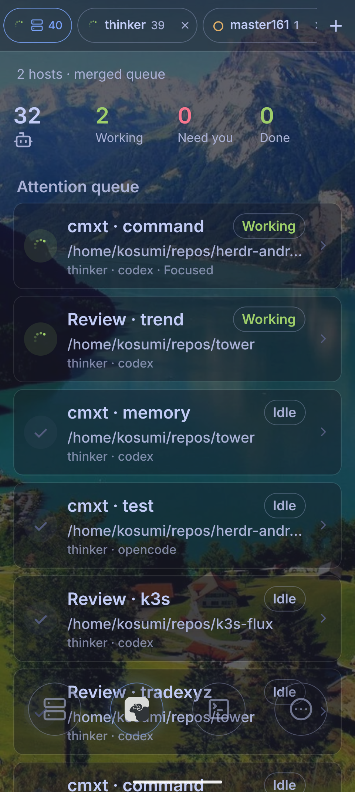
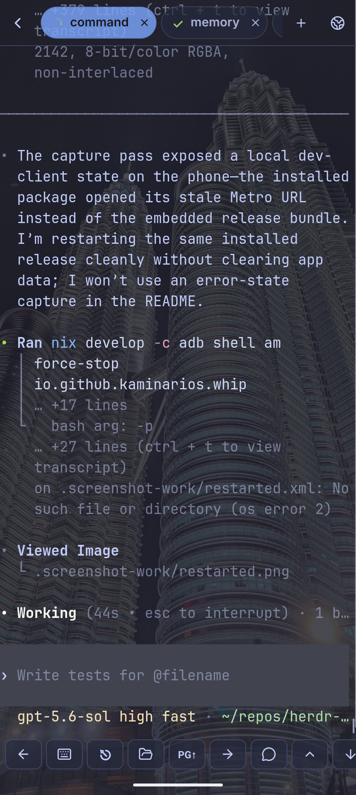
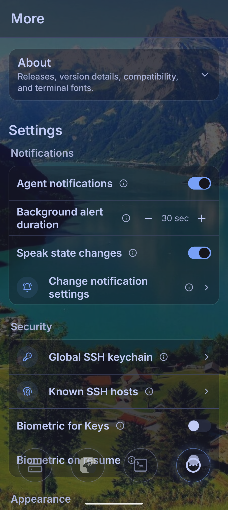

# Whip

<p align="center">
  
</p>

<p align="center">
  <strong>Keep your Herdr agents within reach.</strong><br>
  An independent Android client for supervising agents, scoping hosts and spaces, and opening pane terminals over SSH.
</p>

<p align="center">
  <a href="https://github.com/KaminariOS/whip/actions/workflows/ci.yml"></a>
  <a href="https://github.com/KaminariOS/whip/actions/workflows/codeql.yml"></a>
</p>

Whip gives [Herdr](https://github.com/ogulcancelik/herdr) a touch-friendly Android interface without exposing Herdr itself to the network or requiring changes on the host. It connects to your machine over SSH—directly or through saved jump hosts, ideally over Tailscale—and rebuilds the management experience as native screens. A terminal appears only when you choose to attach to a pane.

The app separates connection management from daily supervision: **Hosts** manages saved SSH endpoints, **Herd** merges their agents into a scoped attention queue, **Terminal** lists open pane sessions, and **More** holds security, notification, appearance, and terminal preferences.

Whip is not developed, maintained, or endorsed by the Herdr project or its authors.

> [!WARNING]
> Whip is an experimental personal project developed for my own needs. I do not know React Native, and I have not read or manually reviewed the generated code. Do not assume the app is secure; review it yourself before trusting it with sensitive systems or credentials. Verify every first-use SSH fingerprint through an independent trusted channel before accepting it.

## Preview

<table>
  <tr>
    <td align="center"></td>
    <td align="center"></td>
  </tr>
  <tr>
    <td align="center"><strong>Manage every host</strong><br>See live connection state, latency, and saved authentication at a glance.</td>
    <td align="center"><strong>Watch the whole herd</strong><br>Merge open hosts into one attention queue, then scope it to a host or space.</td>
  </tr>
  <tr>
    <td align="center"></td>
    <td align="center"></td>
  </tr>
  <tr>
    <td align="center"><strong>Work from anywhere</strong><br>Open a selected pane in the full-width terminal, then collect its web links in one tap.</td>
    <td align="center"><strong>Tune your workflow</strong><br>Configure agent alerts, speech, security, appearance, and terminal behavior.</td>
  </tr>
</table>

Screenshots were captured from a Whip 0.2 preview build on a Pixel 9 Pro.

## What you can do

### Supervise Herdr

- Monitor every open host in one native attention queue, with per-host and per-space scopes.
- See working, blocked, done, idle, and unknown agents, including their host and space context.
- Move through Herdr hosts, spaces, tabs, panes, and agents without living in a terminal.
- Create, focus, rename, split, zoom, inspect, and close space resources.
- Launch agents, send direct prompts, and send commands or special keys to a pane.

### Work in terminals

- Attach to any selected pane through an immersive, xterm-compatible terminal.
- Open a plain SSH login shell when Herdr is stopped, unavailable, or not installed yet.
- Keep multiple terminal surfaces warm while switching or swiping between tabs, with a buffered composer, ANSI colors, modifier keys, touch scrolling, Page Up/Down, selection, live resizing, and configurable appearance.
- Scan terminal scrollback for web links and open local or LAN services in the in-app browser through an on-demand SSH tunnel.

### Move files and attachments

- Browse remote files over SFTP; upload, download, edit, and preview code, text, Markdown, images, and sandboxed HTML.
- Upload a photo, file, camera capture, or clipboard image to the host and paste its remote path into the terminal composer.

### Connect securely

- Import, inspect, copy, remove, or generate SSH keys, and reuse them from a biometric-protected global keychain.
- Route connections through nested, OpenSSH-compatible jump hosts and optionally forward a profile's key as an SSH agent without copying the private key to the server.
- Verify every direct and jump-host connection against a global known-hosts list, prompting for unknown fingerprints and rejecting changed host keys.
- Automatically save each host's password or private-key credential with Android Keystore and encrypted, device-authenticated Block Store recovery.
- Keep several named Herdr hosts open and switch between their live sessions.

### Make it yours

- Receive local notifications, vibration, and optional speech when an agent becomes blocked or finishes.
- Use the app in English or Traditional Chinese, with system, light, GitHub Light, dark, and Tokyo Night appearance options.

## Install an experimental preview

Preview APKs are currently ARM64-only prereleases. Their signing identity may change before Whip reaches a stable release, so Android may require you to uninstall an older preview before installing a newer one.

1. Read the [security policy](SECURITY.md) and [privacy notes](PRIVACY.md).
2. Make the Herdr host reachable over SSH, preferably through a Tailnet you trust. An otherwise private destination can be reached through a saved jump host.
3. Download the APK and checksum from [GitHub Releases](https://github.com/KaminariOS/whip/releases).
4. Verify the download:

   ```bash
   sha256sum -c whip-experimental-arm64.apk.sha256
   ```

5. Allow installation from the app that downloaded the APK, then open Whip.

Whip supports Android 7.0 and newer (`minSdk 24`). The current preview distribution targets 64-bit ARM Android devices.

## Connect your first host

You need an SSH server on a laptop or server reachable from the phone. If Herdr is already installed, confirm the same connection outside Whip first:

```bash
ssh user@laptop.tailnet.ts.net 'herdr status server --json'
```

Then in Whip:

1. Tap **Add your first host**.
2. Enter the Tailscale DNS name or `100.x.y.z` address, SSH user, and password or private key. You can import, paste, or generate an Ed25519 key in the app.
3. Leave **Command** as `herdr`, or enter its absolute path if it is not in the non-interactive SSH `PATH`.
4. Choose the Herdr session name and connect.
5. On first connection, compare the displayed SSH fingerprint with the host through an independent trusted channel, then choose **Trust host**. Whip refuses a changed key on later connections.

Whip saves the credential after you save or connect to a host, enabling one-tap reconnects. Host profiles can also reuse a key from **More → Global SSH keychain**.

For a destination that is not directly reachable, save and connect to the outer host first. Edit the destination, select that profile under **Jump host**, and connect. Jump hosts can themselves use another saved jump host; each hop keeps its own authentication, host-key verification, and optional agent-forwarding setting. Manage trusted fingerprints under **More → Known SSH hosts**.

If Herdr is not installed yet, Whip still keeps the SSH connection open. From the offline host screen, choose **Open SSH shell** and install or troubleshoot Herdr yourself; Whip never installs software on the host.

Whip accepts Herdr releases that report protocol 17 and rejects other protocol versions to avoid sending incompatible commands. The **About Whip** screen shows both sides of the active connection.

## How it works

Whip connects from Android to the configured SSH host, either directly or through its saved jump-host chain. There is no Whip-operated relay service, and Herdr remains bound to the host as usual. Strict known-host verification applies to every hop.

Native screens read snapshots and live events from Herdr's local API sockets through the authenticated SSH connection. Actions use the same structured API, while each open pane terminal uses Herdr's client-protocol socket for live input, resize, scroll, and render frames. The remote file manager and terminal attachments use SFTP on that connection. Links found in terminal scrollback open directly when they are public; loopback and private-network addresses are forwarded through SSH first.

An unknown server key requires explicit fingerprint approval before Whip stores it in the device-wide known-hosts list. A changed key is rejected until you investigate it and deliberately forget the old entry. See [SECURITY.md](SECURITY.md) for the current security posture and [PRIVACY.md](PRIVACY.md) for the data flow and on-device storage details.

## Development

Whip uses Expo SDK 57 with a custom Android development build. It cannot run in Expo Go because SSH, Android Keystore, and the patched PTY stream use native modules.

On NixOS, the included development shell provides Node.js 22, JDK 17, and the required Android SDK and NDK versions. Start Metro in one terminal, in offline mode with Whip's explicit development-client scheme and a LAN bind so the USB-reversed IPv4 endpoint works:

```bash
nix develop
npm ci
npm start -- --scheme whip --host lan --offline
```

Then connect an ARM64 device and build only its architecture from a second development shell:

```bash
nix develop
adb reverse tcp:8081 tcp:8081
ORG_GRADLE_PROJECT_reactNativeArchitectures=arm64-v8a npm run android -- --no-bundler
```

If the development client does not open the project automatically, launch the USB-forwarded localhost URL with Whip's scheme:

```bash
adb shell am start -W \
  -a android.intent.action.VIEW \
  -d 'whip://expo-development-client/?url=http%3A%2F%2Flocalhost%3A8081'
```

On other systems, install Node.js 22, JDK 17, Android SDK Platform 36, Build Tools 36.0.0, NDK 27.1.12297006, and CMake 3.22.1, then use the same `npm` and `adb` commands with `ANDROID_HOME` set.

See [DEBUG.md](DEBUG.md) for the complete emulator and physical-device loop.

### EAS builds

After authenticating and initializing the Expo project:

```bash
npx eas-cli build --profile development --platform android
npx eas-cli build --profile preview --platform android
```

The `development` profile creates an Expo development client. The `preview` profile creates an installable APK.

### Validation

```bash
npx expo-doctor
npx tsc --noEmit
npm run lint
npm test -- --runInBand
npx expo export --platform android
```

The SSH bridge is maintained in [`packages/react-native-ssh-sftp`](packages/react-native-ssh-sftp). The root dependency uses that local package; do not edit or patch its symlink under `node_modules`.

## Community

- Read [CONTRIBUTING.md](CONTRIBUTING.md) before opening a pull request.
- Ask usage and design questions in [GitHub Discussions](https://github.com/KaminariOS/whip/discussions).
- Use the issue forms for reproducible bugs and scoped feature requests.
- Follow the [Code of Conduct](CODE_OF_CONDUCT.md).
- Review the [roadmap](ROADMAP.md) for current priorities.

Feedback is especially useful around Android device compatibility, real-world Herdr workflows, terminal ergonomics, and safe SSH trust UX.

## License

Whip is licensed under the [GNU Affero General Public License v3.0 or later](LICENSE).
