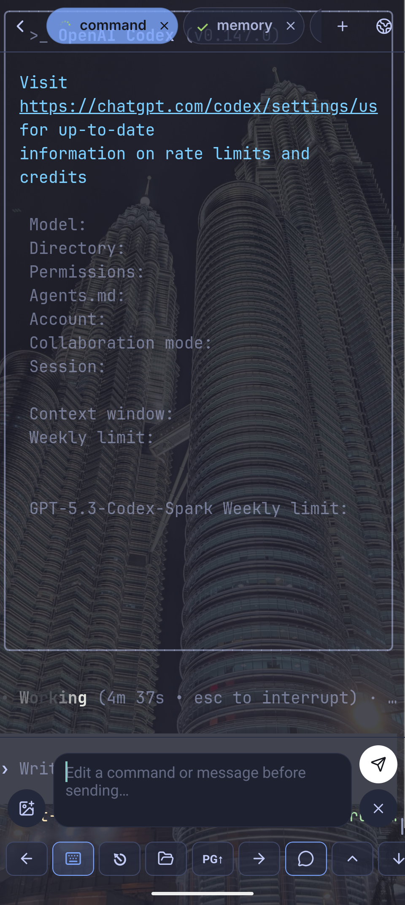
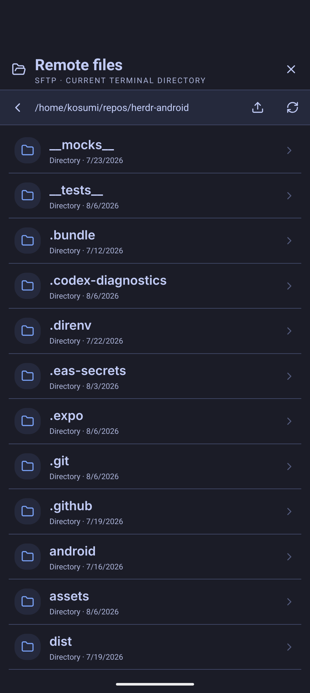
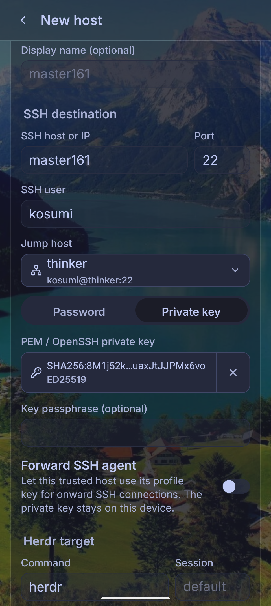
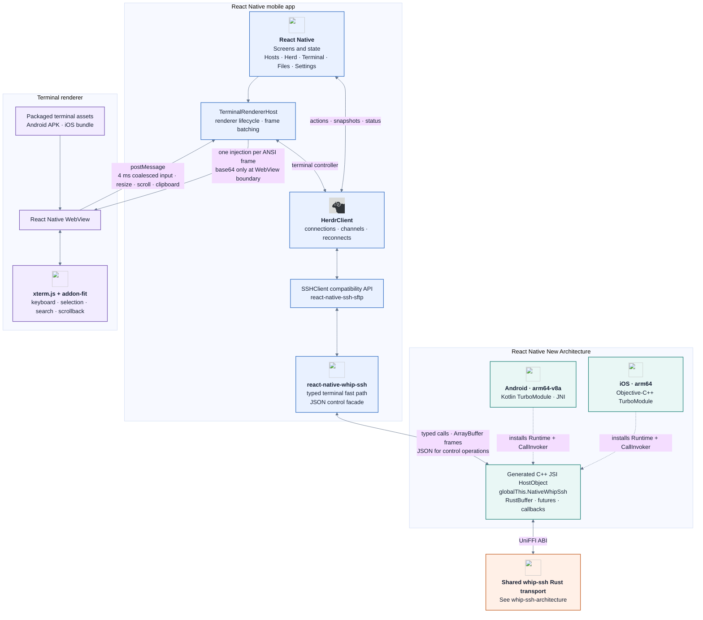
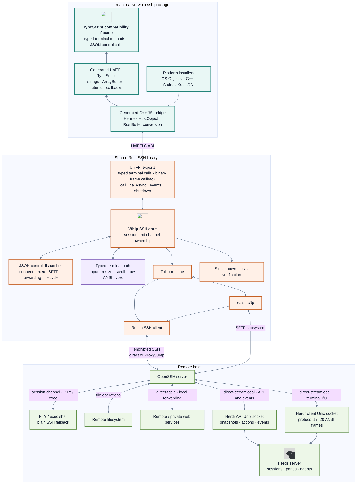

# Whip

<p align="center">
  
</p>

<p align="center">
  <strong>Run your Herdr workflow from Android.</strong><br>
  Monitor and chat with remote agents, work in their terminals, and move files over SSH from a native mobile interface.
</p>

<p align="center">
  <a href="https://github.com/KaminariOS/whip/actions/workflows/ci.yml"></a>
  <a href="https://github.com/KaminariOS/whip/actions/workflows/codeql.yml"></a>
  <a href="https://expo.dev"></a>
  <a href="#help-bring-whip-to-ios"></a>
</p>

<p align="center">
  <a href="https://play.google.com/store/apps/details?id=io.github.kaminarios.whip"></a><br>
  Early Access: <a href="https://groups.google.com/g/whip-community">join the Whip Community</a>, wait a moment for access to propagate, then use the Google Play link above.
</p>

<p align="center">
  <a href="https://youtu.be/dx5s3LmMErE"></a><br>
  <a href="https://youtu.be/dx5s3LmMErE"><strong>Watch the Whip launch video</strong></a>
</p>

Whip gives [Herdr](https://github.com/ogulcancelik/herdr) a touch-friendly Android interface without exposing Herdr itself to the network or requiring changes on the host. It connects to your machine over SSH—directly or through saved jump hosts, ideally over Tailscale—and rebuilds the management experience as native screens. You can watch the whole herd, prompt an agent through a native chat composer, browse remote files, or attach to a full terminal when you need it.

The app separates connection management from daily supervision: **Hosts** manages saved SSH endpoints and exposes their live Herdr state, **Herd** merges connected agents into a scoped attention queue, **Terminal** keeps open pane sessions within reach, and **More** holds security, notification, appearance, and terminal preferences.

Whip is not developed, maintained, or endorsed by the Herdr project or its authors.

## Preview

<table>
  <tr>
    <td align="center"></td>
    <td align="center"></td>
  </tr>
  <tr>
    <td align="center"><strong>Manage every host</strong><br>See live connection state, latency, and saved authentication at a glance.</td>
    <td align="center"><strong>Watch the whole herd</strong><br>Merge open hosts into one attention queue, then scope it to a host or space.</td>
  </tr>
  <tr>
    <td align="center"></td>
    <td align="center"></td>
  </tr>
  <tr>
    <td align="center"><strong>Work from anywhere</strong><br>Keep remote terminal tabs warm, use mobile controls, and open discovered web links or remote files in one tap.</td>
    <td align="center"><strong>Chat naturally</strong><br>Prompt a remote agent from the native multiline composer with Android keyboard, suggestion, and voice-input support.</td>
  </tr>
  <tr>
    <td align="center"></td>
    <td align="center"></td>
  </tr>
  <tr>
    <td align="center"><strong>Bring the filesystem with you</strong><br>Browse, sort, upload, download, edit, delete, or preview the terminal's remote files over SFTP.</td>
    <td align="center"><strong>Reach private hosts safely</strong><br>Build nested jump-host routes and opt into SSH agent forwarding without placing the private key on the server.</td>
  </tr>
  <tr>
    <td align="center" colspan="2"></td>
  </tr>
  <tr>
    <td align="center" colspan="2"><strong>Make Whip yours</strong><br>Place translucent app surfaces over a custom background, then tune alerts, speech, security, navigation, and terminal behavior.</td>
  </tr>
</table>

Screenshots were captured from the current ARM64 release build on a Pixel 9 Pro.

## What you can do

### Supervise Herdr

- Monitor every open host in one native attention queue, with per-host and per-space scopes.
- See working, blocked, done, idle, and unknown agents, including their host and space context.
- Keep connected hosts first and order them by the same agent-status priority as the Herd queue; see each host's agent count, Herdr protocol, measured latency, and jump-host route.
- Move through Herdr hosts, spaces, tabs, panes, and agents without living in a terminal.
- Create, focus, rename, split, zoom, inspect, and close space resources, including swipe-to-close Herd tabs.
- Launch agents and chat through a native multiline composer that works with Android keyboards, including Gboard voice input and suggestions.
- Run editable commands from the Herd screen and reuse the same persistent input history available in the terminal.

### Work in terminals

- Attach to any selected pane through an immersive, xterm-compatible terminal.
- Open a plain SSH login shell when Herdr is stopped, unavailable, or not installed yet.
- Keep multiple terminal surfaces warm while switching or swiping between tabs, with a buffered composer, ANSI colors, modifier keys, touch scrolling, Page Up/Down, selection, live resizing, and configurable appearance.
- Reuse persistent input history, copy previous commands with a long press, and configure fullscreen behavior, volume-key and double-tap actions, and the number of cached xterm surfaces.
- Scan terminal scrollback for web links and open local or LAN services in the in-app browser through an on-demand SSH tunnel.
- Recover open control connections after network changes and app resume without restarting healthy sessions.

### Move files and attachments

- Browse the active terminal's current directory over SFTP, remember a location per terminal, and sort by name, modification time, or size.
- Upload, download, edit, or swipe-delete remote files; preview code, text, Markdown with remote links and images, raster images, SVG, standalone Mermaid diagrams, streamed PDF and video, and sandboxed HTML.
- Upload a photo, file, camera capture, or clipboard image to the host and paste its remote path into the terminal composer.

### Connect securely

- Import, inspect, copy, remove, or generate SSH keys, and reuse them from a biometric-protected global keychain.
- Route connections through nested, OpenSSH-compatible jump hosts and optionally forward a profile's key as an SSH agent without copying the private key to the server.
- Verify every direct and jump-host connection against a global known-hosts list, prompting for unknown fingerprints and rejecting changed host keys.
- Automatically save each host's password or private-key credential with Android Keystore and encrypted, device-authenticated Block Store recovery.
- Keep several named Herdr hosts open and switch between their live sessions.

### Make it yours

- Receive local notifications, vibration, and optional speech when an agent becomes blocked or finishes.
- Set the duration of background agent alerts, dismiss active alerts by returning to Whip, and customize terminal gestures, controls, history, fonts, and cached sessions.
- Use the app in English or Traditional Chinese, with system, light, GitHub Light, dark, and Tokyo Night appearance options.
- Choose an app background image and optionally layer experimental translucent glass bars, rows, controls, and navigation over it.

## Install Whip

The recommended installation is through the [Google Play Early Access program](https://play.google.com/store/apps/details?id=io.github.kaminarios.whip). Before using the Google Play link, you must join the [Whip Community](https://groups.google.com/g/whip-community) and wait a moment for your membership to propagate. Google requires 12 closed testers to remain enrolled for 14 days before the app can be released publicly.

Signed ARM64 APKs are also published as normal latest releases on [GitHub Releases](https://github.com/KaminariOS/whip/releases). They use the project's existing release key and include a SHA-256 checksum alongside the APK.

1. Read the [security policy](SECURITY.md) and [privacy notes](PRIVACY.md).
2. Install through Google Play, or download `whip-arm64.apk` from the latest GitHub release.
3. Allow installation from the app that downloaded the APK, then open Whip.
4. Make the Herdr host reachable over SSH, preferably through a Tailnet you trust. An otherwise private destination can be reached through a saved jump host.(Normal SSH host without herdr is also supported)

Whip supports Android 7.0 and newer (`minSdk 24`). The current direct APK distribution targets 64-bit ARM Android devices. Keep using the same distribution source when updating: Google Play may re-sign store builds through Play App Signing, so Android can require an uninstall when switching between Play and GitHub packages.

## Connect your first host

You need an SSH server on a laptop or server reachable from the phone. If Herdr is already installed, confirm the same connection outside Whip first:

```bash
ssh user@laptop.tailnet.ts.net 'herdr status server --json'
```

Then in Whip:

1. Tap **Add your first host**.
2. Enter the Tailscale DNS name or `100.x.y.z` address, SSH user, and password or private key. You can import, paste, or generate an Ed25519 key in the app.
3. Leave **Command** as `herdr`, or enter its absolute path if it is not in the non-interactive SSH `PATH`.
4. Choose the Herdr session name and connect.
5. On first connection, compare the displayed SSH fingerprint with the host through an independent trusted channel, then choose **Trust host**. Whip refuses a changed key on later connections.

Whip saves the credential after you save or connect to a host, enabling one-tap reconnects. Host profiles can also reuse a key from **More → Global SSH keychain**.

For a destination that is not directly reachable, save and connect to the outer host first. Edit the destination, select that profile under **Jump host**, and connect. Jump hosts can themselves use another saved jump host; each hop keeps its own authentication, host-key verification, and optional agent-forwarding setting. Manage trusted fingerprints under **More → Known SSH hosts**.

If Herdr is not installed yet, Whip still keeps the SSH connection open. From the offline host screen, choose **Open SSH shell** and install or troubleshoot Herdr yourself; Whip never installs software on the host.

Whip accepts Herdr releases that report protocols 17 through 20 and rejects other protocol versions to avoid sending incompatible commands. The **About Whip** screen shows both sides of the active connection.

## How it works

Whip connects from Android to the configured SSH host, either directly or through its saved jump-host chain. There is no Whip-operated relay service, and Herdr remains bound to the host as usual. Strict known-host verification applies to every hop.

Native screens read snapshots and live events from Herdr's local API sockets through the authenticated SSH connection. Actions use the same structured API, while each open pane terminal uses Herdr's client-protocol socket for live input, resize, scroll, and render frames. The remote file manager and terminal attachments use SFTP on that connection. Links found in terminal scrollback open directly when they are public; loopback and private-network addresses are forwarded through SSH first.

An unknown server key requires explicit fingerprint approval before Whip stores it in the device-wide known-hosts list. A changed key is rejected until you investigate it and deliberately forget the old entry. See [SECURITY.md](SECURITY.md) for the current security posture and [PRIVACY.md](PRIVACY.md) for the data flow and on-device storage details.

## Architecture

Whip is split between the React Native mobile application and the shared Rust SSH transport. The diagrams below show both halves and their native bridge, terminal, Herdr, and remote-host boundaries.

### Mobile app


```mermaid
%%{init: {
  "theme": "base",
  "themeVariables": {
    "background": "#ffffff",
    "primaryTextColor": "#172033",
    "lineColor": "#64748b",
    "fontFamily": "Inter, ui-sans-serif, system-ui, sans-serif"
  },
  "flowchart": {
    "curve": "basis",
    "htmlLabels": true,
    "nodeSpacing": 34,
    "rankSpacing": 48
  }
}}%%
flowchart TB
  subgraph ReactNative["React Native mobile app"]
    direction LR
    App["<span style='display:inline-block;width:44px;height:44px'><img src='https://api.iconify.design/logos/react.svg' width='44' height='44'/></span><br/><b>React Native</b><br/>Screens and state<br/>Hosts · Herd · Terminal · Files · Settings"]
    TerminalHost["TerminalRendererHost<br/>renderer lifecycle · frame batching"]
    HerdrClient["<span style='display:inline-block;width:44px;height:44px'><img src='' width='44' height='44'/></span><br/><b>HerdrClient</b><br/>connections · channels · reconnects"]
    SSHClient["SSHClient compatibility API<br/>react-native-ssh-sftp"]
    WhipApi["<span style='display:inline-block;width:44px;height:44px'><img src='https://raw.githubusercontent.com/KaminariOS/whip/main/assets/whip-cyborg-hand-concept.svg' width='44' height='44'/></span><br/><b>react-native-whip-ssh</b><br/>typed terminal fast path<br/>JSON control facade"]

    App --> TerminalHost
    App <-->|"actions · snapshots · status"| HerdrClient
    TerminalHost <-->|"terminal controller"| HerdrClient
    HerdrClient <--> SSHClient
    SSHClient <--> WhipApi
  end

  subgraph Terminal["Terminal renderer"]
    direction LR
    WebView["React Native WebView"]
    Xterm["<span style='display:inline-block;width:44px;height:44px'><img src='https://raw.githubusercontent.com/xtermjs/xtermjs-branding/master/logo.svg' width='44' height='44'/></span><br/><b>xterm.js + addon-fit</b><br/>keyboard · selection · search · scrollback"]
    Assets["Packaged terminal assets<br/>Android APK · iOS bundle"]

    WebView <--> Xterm
    Assets --> WebView
  end

  TerminalHost -->|"one injection per ANSI frame<br/>base64 only at WebView boundary"| WebView
  WebView -->|"postMessage<br/>4 ms coalesced input · resize · scroll · clipboard"| TerminalHost

  subgraph Platform["React Native New Architecture"]
    direction LR
    IOS["<span style='display:inline-block;width:40px;height:40px'><img src='https://api.iconify.design/logos/apple.svg' width='40' height='40'/></span><br/><b>iOS · arm64</b><br/>Objective-C++ TurboModule"]
    JSI["Generated C++ JSI HostObject<br/>globalThis.NativeWhipSsh<br/>RustBuffer · futures · callbacks"]
    Android["<span style='display:inline-block;width:40px;height:40px'><img src='https://api.iconify.design/logos/android-icon.svg' width='40' height='40'/></span><br/><b>Android · arm64-v8a</b><br/>Kotlin TurboModule · JNI"]

    IOS -.->|"installs Runtime + CallInvoker"| JSI
    Android -.->|"installs Runtime + CallInvoker"| JSI
  end

  WhipApi <-->|"typed calls · ArrayBuffer frames<br/>JSON for control operations"| JSI
  JSI <-->|"UniFFI ABI"| Transport["<span style='display:inline-block;width:44px;height:44px'><img src='https://api.iconify.design/logos/rust.svg' width='44' height='44'/></span><br/><b>Shared whip-ssh Rust transport</b><br/>See whip-ssh-architecture"]

  classDef react fill:#e9f1ff,stroke:#3772c5,color:#172033,stroke-width:1.5px
  classDef terminal fill:#f2ecff,stroke:#7958b5,color:#172033,stroke-width:1.5px
  classDef native fill:#e9f7f5,stroke:#23847a,color:#172033,stroke-width:1.5px
  classDef rust fill:#fff0e7,stroke:#c45f24,color:#172033,stroke-width:1.5px

  class App,TerminalHost,HerdrClient,SSHClient,WhipApi react
  class WebView,Xterm,Assets terminal
  class IOS,JSI,Android native
  class Transport rust
```

[Edit the mobile app diagram](docs/mobile-app-architecture.mmd).

### Whip SSH transport


```mermaid
%%{init: {
  "theme": "base",
  "themeVariables": {
    "background": "#ffffff",
    "primaryTextColor": "#172033",
    "lineColor": "#64748b",
    "fontFamily": "Inter, ui-sans-serif, system-ui, sans-serif"
  },
  "flowchart": {
    "curve": "basis",
    "htmlLabels": true,
    "nodeSpacing": 34,
    "rankSpacing": 48
  }
}}%%
flowchart TB
  subgraph Package["react-native-whip-ssh package"]
    direction LR
    Facade["<span style='display:inline-block;width:44px;height:44px'><img src='https://raw.githubusercontent.com/KaminariOS/whip/main/assets/whip-cyborg-hand-concept.svg' width='44' height='44'/></span><br/><b>TypeScript compatibility facade</b><br/>typed terminal methods · JSON control calls"]
    Bindings["Generated UniFFI TypeScript<br/>strings · ArrayBuffer · futures · callbacks"]
    JSI["Generated C++ JSI bridge<br/>Hermes HostObject · RustBuffer conversion"]
    Platforms["Platform installers<br/>iOS Objective-C++ · Android Kotlin/JNI"]

    Facade <--> Bindings
    Bindings <--> JSI
    Platforms -.-> JSI
  end

  subgraph Rust["Shared Rust SSH library"]
    direction LR
    UniFFI["UniFFI exports<br/>typed terminal calls · binary frame callback<br/>call · callAsync · events · shutdown"]
    Core["<span style='display:inline-block;width:44px;height:44px'><img src='https://api.iconify.design/logos/rust.svg' width='44' height='44'/></span><br/><b>Whip SSH core</b><br/>session and channel ownership"]
    Control["JSON control dispatcher<br/>connect · exec · SFTP · forwarding · lifecycle"]
    Terminal["Typed terminal path<br/>input · resize · scroll · raw ANSI bytes"]
    Tokio["Tokio runtime"]
    KnownHosts["Strict known_hosts verification"]
    Russh["Russh SSH client"]
    SFTP["russh-sftp"]

    UniFFI <--> Core
    Core <--> Control
    Core <--> Terminal
    Core <--> Tokio
    Core --> KnownHosts
    Tokio <--> Russh
    Tokio <--> SFTP
    SFTP --> Russh
  end

  JSI <-->|"UniFFI C ABI"| UniFFI

  subgraph Remote["Remote host"]
    direction LR
    SSHD["OpenSSH server"]
    Shell["PTY / exec shell<br/>plain SSH fallback"]
    FileSystem["Remote filesystem"]
    TCPServices["Remote / private web services"]
    APISocket["Herdr API Unix socket<br/>snapshots · actions · events"]
    ClientSocket["Herdr client Unix socket<br/>protocol 17–20 ANSI frames"]
    Herdr["<span style='display:inline-block;width:44px;height:44px'><img src='' width='44' height='44'/></span><br/><b>Herdr server</b><br/>sessions · panes · agents"]

    APISocket <--> Herdr
    ClientSocket <--> Herdr
  end

  Russh <-->|"encrypted SSH<br/>direct or ProxyJump"| SSHD
  SFTP <-->|"SFTP subsystem"| SSHD
  SSHD <-->|"session channel · PTY / exec"| Shell
  SSHD <-->|"file operations"| FileSystem
  SSHD <-->|"direct-tcpip · local forwarding"| TCPServices
  SSHD <-->|"direct-streamlocal · API and events"| APISocket
  SSHD <-->|"direct-streamlocal · terminal I/O"| ClientSocket

  classDef package fill:#e9f7f5,stroke:#23847a,color:#172033,stroke-width:1.5px
  classDef rust fill:#fff0e7,stroke:#c45f24,color:#172033,stroke-width:1.5px
  classDef remote fill:#edf7e8,stroke:#5f8f45,color:#172033,stroke-width:1.5px
  classDef terminal fill:#f2ecff,stroke:#7958b5,color:#172033,stroke-width:1.5px

  class Facade,Bindings,JSI,Platforms package
  class UniFFI,Core,Control,Tokio,KnownHosts,Russh,SFTP rust
  class Terminal terminal
  class SSHD,Shell,FileSystem,TCPServices,APISocket,ClientSocket,Herdr remote
```

[Edit the Whip SSH transport diagram](docs/whip-ssh-architecture.mmd).

## Development

Whip uses Expo SDK 57 with a custom Android development build. It cannot run in Expo Go because SSH, Android Keystore, and the patched PTY stream use native modules.

On NixOS, the included development shell provides Node.js 22, JDK 17, and the required Android SDK and NDK versions. Start Metro in one terminal, in offline mode with Whip's explicit development-client scheme and a LAN bind so the USB-reversed IPv4 endpoint works:

```bash
nix develop
npm ci
npm start -- --scheme whip --host lan --offline
```

Then connect an ARM64 device and build only its architecture from a second development shell:

```bash
nix develop
adb reverse tcp:8081 tcp:8081
ORG_GRADLE_PROJECT_reactNativeArchitectures=arm64-v8a npm run android -- --no-bundler
```

If the development client does not open the project automatically, launch the USB-forwarded localhost URL with Whip's scheme:

```bash
adb shell am start -W \
  -a android.intent.action.VIEW \
  -d 'whip://expo-development-client/?url=http%3A%2F%2Flocalhost%3A8081'
```

On other systems, install Node.js 22, JDK 17, Android SDK Platform 36, Build Tools 36.0.0, NDK 27.1.12297006, and CMake 3.22.1, then use the same `npm` and `adb` commands with `ANDROID_HOME` set.

See [DEBUG.md](DEBUG.md) for the complete emulator and physical-device loop.

### EAS builds

After authenticating and initializing the Expo project:

```bash
npx eas-cli build --profile development --platform android
npx eas-cli build --profile preview --platform android
```

The `development` profile creates an Expo development client. The `preview` profile creates an installable APK.

### Google Play publishing

The manually triggered `Publish Android app bundle` GitHub Actions workflow builds a signed ARM64 `.aab` and uploads it through EAS Submit. Its default `production-draft` profile leaves the release in Google Play Console for manual review; the `internal` profile publishes it to internal testers.

Before the first run, create a Google Play service account with Play Console access and an Expo access token, then configure these GitHub repository or `google-play` environment secrets:

- `ANDROID_UPLOAD_KEYSTORE_BASE64`: the base64-encoded Play upload keystore
- `ANDROID_UPLOAD_KEYSTORE_PASSWORD`
- `ANDROID_UPLOAD_KEY_ALIAS`
- `ANDROID_UPLOAD_KEY_PASSWORD`
- `GOOGLE_PLAY_SERVICE_ACCOUNT_JSON`: the complete service-account JSON document
- `EXPO_TOKEN`

For example:

```bash
base64 -w 0 /path/to/upload-keystore.jks | gh secret set ANDROID_UPLOAD_KEYSTORE_BASE64
gh secret set ANDROID_UPLOAD_KEYSTORE_PASSWORD
gh secret set ANDROID_UPLOAD_KEY_ALIAS
gh secret set ANDROID_UPLOAD_KEY_PASSWORD
gh secret set GOOGLE_PLAY_SERVICE_ACCOUNT_JSON < /path/to/google-play-service-account.json
gh secret set EXPO_TOKEN
```

Increment `versionCode` in `android/app/build.gradle` for every Play upload, commit the release, and start a draft upload with:

```bash
gh workflow run publish-play.yml -f submit_profile=production-draft
```

### Validation

```bash
npx expo-doctor
npx tsc --noEmit
npm run lint
npm test -- --runInBand
npx expo export --platform android
```

The SSH bridge is maintained in [`packages/react-native-ssh-sftp`](packages/react-native-ssh-sftp). The root dependency uses that local package; do not edit or patch its symlink under `node_modules`.

## Community

- Read [CONTRIBUTING.md](CONTRIBUTING.md) before opening a pull request.
- Ask usage and design questions in [GitHub Discussions](https://github.com/KaminariOS/whip/discussions).
- Use the issue forms for reproducible bugs and scoped feature requests.
- Follow the [Code of Conduct](CODE_OF_CONDUCT.md).
- Review the [roadmap](ROADMAP.md) for current priorities.

Feedback is especially useful around Android device compatibility, real-world Herdr workflows, terminal ergonomics, and safe SSH trust UX.

### Help bring Whip to iOS

Whip's React Native and Expo code is designed to be portable to iOS, but I do not have a Mac or an Apple Developer account to build, test, sign, and publish an iOS release. If you have iOS development experience and access to the required Apple hardware and developer tools, community help with validating the native dependencies, preparing an iOS build, testing it on real devices, and working toward a TestFlight or App Store release would be greatly appreciated. Please start a discussion or open an issue if you would like to help.

## Credits

Whip learned from [Voltius](https://github.com/VoltiusApp/voltius) during the early stages of development. We are grateful to the Voltius maintainers and contributors for sharing their work.

## License

Whip is licensed under the [GNU Affero General Public License v3.0 or later](LICENSE).
