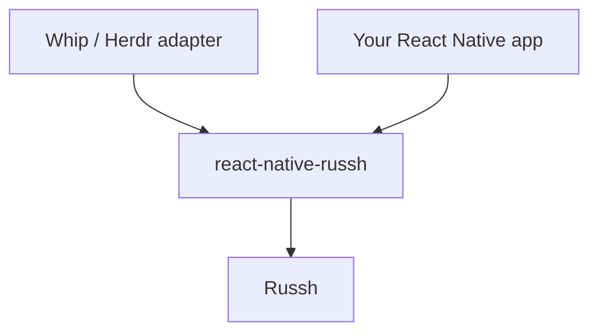

# react-native-russh

React Native SSH and SFTP for the New Architecture, powered by
[`russh`](https://github.com/Eugeny/russh).

The package intentionally exposes only generic SSH capabilities. Whip's WP3
QR pairing and Herdr protocols live in a separate private adapter.



## Requirements

- React Native 0.76 or newer with the New Architecture enabled
- Android 7.0 / API 24 or newer on ARM64 (`arm64-v8a`)
- iOS 16.4 or newer on ARM64 devices and Apple Silicon simulators

Intel Android emulators and Intel iOS simulators are not included in the
initial release.

## Install

```sh
npm install react-native-russh
```

For iOS, install pods after npm finishes:

```sh
cd ios && pod install
```

## Quick start

`react-native-russh` verifies host keys strictly. Load an OpenSSH
`known_hosts` entry before connecting; an unknown or changed key rejects the
connection with structured details in the error message.

```ts
import SSHClient from 'react-native-russh';

SSHClient.setKnownHosts(
  'server.example ssh-ed25519 AAAAC3NzaC1lZDI1NTE5AAAA...',
);

const ssh = await SSHClient.connectWithKey(
  'server.example',
  22,
  'alice',
  privateKey,
);

const output = await ssh.execute('uname -a');
const files = await ssh.sftpLs('/var/log');
ssh.disconnect();
```

## Public capabilities

- OpenSSH `known_hosts` verification, including hashed hostnames
- Ed25519, RSA, and ECDSA private-key authentication supported by Russh
- Password authentication and jump hosts
- Key generation and key inspection
- Command execution and interactive PTY shells
- SSH agent forwarding for private-key sessions
- Local TCP forwarding and host-latency measurement
- SFTP listing, mutation, upload, download, cancellation, and ranged serving

No Whip, Herdr, or QR-pairing type or method is exported from the package root.

## Development

From the Whip repository root:

```sh
nix develop -c cargo fmt --check \
  --manifest-path packages/react-native-russh/rust/Cargo.toml
nix develop -c cargo clippy --locked --all-targets \
  --manifest-path packages/react-native-russh/rust/Cargo.toml -- -D warnings
nix develop -c cargo test --locked \
  --manifest-path packages/react-native-russh/rust/Cargo.toml
nix develop -c bash packages/react-native-russh/rust/build-android.sh
```

## License and provenance

The Rust/Russh transport and Whip-maintained React Native integration are
licensed under `AGPL-3.0-or-later`. The compatibility shape of `SSHClient`
descends from the MIT-licensed `react-native-ssh-sftp` fork family; see
[`PROVENANCE.md`](PROVENANCE.md).
