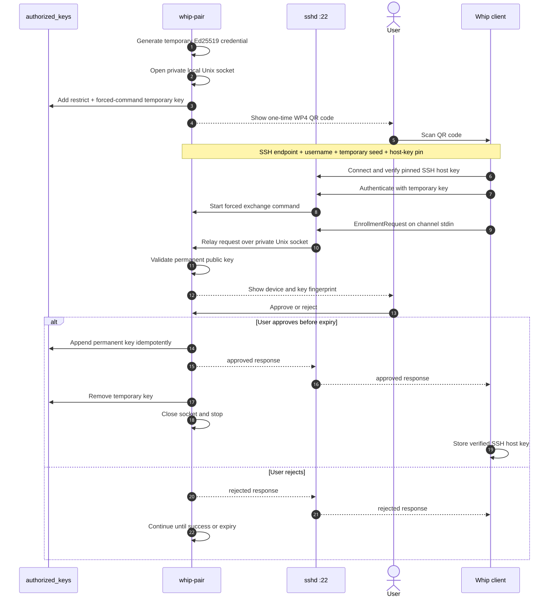

# whip-pair prototype

`whip-pair` is a direct, one-shot SSH public-key enrollment prototype for
Whip. It uses the host's existing SSH port: no relay, TLS listener, additional
firewall rule, pairing account, or `sshd_config` change is required.

The host creates a temporary Ed25519 credential and adds only its public half
to the current user's `authorized_keys` with `restrict` and a forced command.
The QR contains the private seed, SSH endpoint, username, and SSH host-key pin.
Whip uses that credential for one restricted exchange, the host user approves
the submitted permanent public key, and `whip-pair` removes the temporary
authorization.

## Pairing protocol (WP4)

[](docs/wp4-sequence.mmd)

The canonical Mermaid source is [`docs/wp4-sequence.mmd`](docs/wp4-sequence.mmd).
Render and validate the tracked SVG with:

```bash
nix shell nixpkgs#mermaid-cli -c mmdc \
  -i whip-pair/docs/wp4-sequence.mmd \
  -o whip-pair/docs/wp4-sequence.svg
```

### QR bootstrap envelope

The QR contains `WP4:` followed by Base45-encoded binary data.

| Field                       | Encoding                                            | Purpose                                     |
| --------------------------- | --------------------------------------------------- | ------------------------------------------- |
| Address type                | 1 byte                                              | `1` IPv4, `2` IPv6, or `3` hostname         |
| SSH host                    | 4 or 16 bytes, or 1-byte length plus ASCII hostname | Address selected or advertised by the host  |
| SSH port                    | 2-byte unsigned integer, big-endian                 | Existing SSH service port                   |
| SSH username                | 1-byte length plus ASCII                            | Existing local account                      |
| Temporary Ed25519 seed      | 32 random bytes                                     | Restricted SSH bearer credential            |
| SSH host-key SHA-256 digest | 32 bytes                                            | Pins the SSH server identity during pairing |

For an IPv4 address and a five-character username, the complete code is 120
characters and renders as a 37-module QR at error-correction level L. Expiry
is enforced by the running host process and is intentionally omitted.

### Host authorization and exchange

Before displaying the QR, `whip-pair` adds an entry equivalent to:

```text
restrict,command="whip-pair exchange --socket …" ssh-ed25519 AAAA… whip-pair-temporary
```

`restrict` disables shell access, PTY allocation, forwarding, agent forwarding,
X11, and user startup commands. The forced command accepts one bounded JSON
`EnrollmentRequest` on SSH stdin and relays it through a Unix socket in a
mode-`0700` temporary directory to the visible `whip-pair` process.

The parent process validates the submitted OpenSSH public key, displays its
SHA-256 fingerprint, and asks the local user to approve it. On approval it
appends the permanent key safely and idempotently, replies with an
`EnrollmentResponse`, removes the temporary entry, and exits. Rejection leaves
the one-shot invitation available until its TTL expires.

Whip verifies the SSH host key against the digest in the QR before sending any
enrollment data. After pairing, it stores the verified public host key in its
global known-hosts list, so the saved host does not require a second trust
prompt.

### Security properties and boundaries

- The QR is a short-lived bearer credential. Anyone who can scan it and reach
  SSH can request enrollment, but the key can invoke only the forced exchange
  command and the host still asks for approval.
- WP4 transfers a temporary private-key seed, never the private half of the
  permanent key being enrolled. Normal SSH authentication later proves
  possession of that permanent key.
- The temporary key is removed on success, expiry, or Ctrl-C. If the process is
  killed before cleanup, the leftover entry remains restricted and its forced
  command cannot connect to the vanished private Unix socket.
- Bare OpenSSH public keys understood by Whip's `ssh-key` parser are accepted.
  `authorized_keys` options are rejected, comments are preserved, and duplicate
  permanent keys are not appended.
- The writer refuses symlink targets and files not owned by the current user,
  locks updates, uses atomic replacement for removal, and creates `.ssh` and
  `authorized_keys` with modes `0700` and `0600` when needed.

## Run with Nix

Run the public version:

```bash
nix run github:KaminariOS/whip#whip-pair
```

Select a specific reachable address when needed:

```bash
nix run github:KaminariOS/whip#whip-pair -- serve --bind 192.168.1.10
```

If SSH is already listening on a nonstandard port, advertise it with
`--ssh-port`:

```bash
nix run github:KaminariOS/whip#whip-pair -- serve \
  --bind 192.168.1.10 \
  --ssh-port 2222
```

`--ssh-port` defaults to `22`. It does not open a new port; it must match the
existing SSH service reachable at the selected or advertised host.

From a local checkout:

```bash
nix run .#whip-pair
```

The Nix app includes `ssh-keyscan`. Automatic discovery requests Ed25519,
ECDSA, and RSA host keys in Whip's `russh` preference order. Use
`--ssh-fingerprint` to provide a fingerprint explicitly.

During development, print the underlying envelope:

```bash
nix run .#whip-pair -- serve --bind 192.168.1.10 --print-code
```

Exercise the SSH-only protocol with a disposable public key:

```bash
nix run .#whip-pair -- request \
  --code 'WP4:...' \
  --public-key ~/.ssh/id_ed25519.pub \
  --device-name 'Prototype client'
```

Inspect a copied envelope without exposing its temporary private seed:

```bash
nix run .#whip-pair -- inspect 'WP4:...'
```

## Prototype limitations

- The SSH server must use OpenSSH-compatible `authorized_keys`, support the
  `restrict` and `command` options, and read the current user's default
  `~/.ssh/authorized_keys` file.
- Automatic host-key discovery invokes `ssh-keyscan`; the Nix app supplies it.
- The terminal QR uses error-correction level L to stay compact.
- Whip's mobile scanner supports WP4. The `request` subcommand remains a
  protocol test client.
