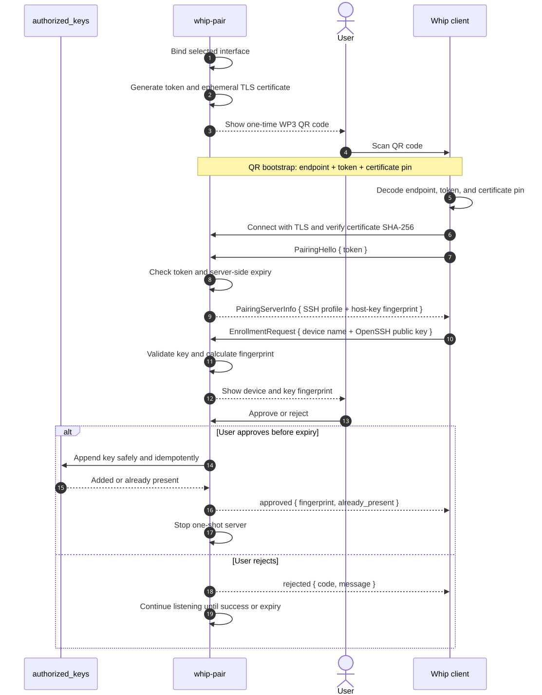

# whip-pair prototype

`whip-pair` is a direct, one-shot SSH public-key enrollment prototype for
Whip. The host binds a selected network interface, displays a QR code carrying
a compact bootstrap containing only the pairing endpoint, a one-time token,
and the SHA-256 pin of an ephemeral TLS certificate. After pinned TLS is
established, the server sends the SSH profile, asks the local user to approve
the submitted key, appends it safely to `authorized_keys`, and exits.

This prototype intentionally has no relay and no permanent service.

The pairing listener uses TCP port `8765` by default. The port must be
reachable from the phone on the selected interface. On NixOS, scope the
firewall opening to Tailscale when that is the pairing network:

```nix
networking.firewall.interfaces.tailscale0.allowedTCPPorts = [ 8765 ];
```

Use `--port 0` only when the firewall already permits dynamically selected
ports, or choose another explicitly allowed port with `--port`.

## Pairing protocol (WP3)

WP3 uses the QR code only to bootstrap a direct connection from Whip to the
host. There is no relay, account, discovery service, or long-running daemon.
The SSH public key is not embedded in the QR code.

[](docs/wp3-sequence.mmd)

The canonical Mermaid source is [`docs/wp3-sequence.mmd`](docs/wp3-sequence.mmd).

Render and validate it locally with:

```bash
nix shell nixpkgs#mermaid-cli -c mmdc \
  -i whip-pair/docs/wp3-sequence.mmd \
  -o whip-pair/docs/wp3-sequence.svg
```

Commit the generated SVG so Markdown previews can display the diagram without
duplicating its Mermaid source in this README.

### QR bootstrap envelope

The QR contains `WP3:` followed by Base45-encoded binary data. Fixed-width
binary fields keep the QR substantially smaller than a URL or JSON document.

| Field               | Encoding                                            | Purpose                                          |
| ------------------- | --------------------------------------------------- | ------------------------------------------------ |
| Address type        | 1 byte                                              | `1` for IPv4, `2` for IPv6, `3` for hostname     |
| Pairing address     | 4 or 16 bytes, or 1-byte length plus ASCII hostname | Address selected or advertised by the host       |
| Pairing port        | 2-byte unsigned integer, big-endian                 | Direct TCP listener port                         |
| Token               | 16 random bytes                                     | One-time 128-bit bearer secret                   |
| TLS certificate pin | 32 bytes                                            | SHA-256 of the ephemeral certificate in DER form |

The envelope deliberately omits the SSH user, SSH port, SSH host-key
fingerprint, and expiry. The server delivers the SSH profile only after the
client has established pinned TLS and presented the token. Expiry is based on
the host's clock and is enforced by the running server.

### Wire exchange

After TLS is established, each application message is one newline-terminated
JSON object, limited to 16 KiB. The exchange is:

1. The client sends `PairingHello` with the 16-byte token encoded as unpadded
   Base64url.
2. The server validates the token and expiry, then sends `PairingServerInfo`
   containing `ssh_host`, `ssh_port`, `ssh_user`, and
   `ssh_host_fingerprint`.
3. The client sends an `EnrollmentRequest` containing `device_name` and
   `public_key`.
4. The server validates the OpenSSH public key and shows its SHA-256 fingerprint
   in the host terminal. The host user approves or rejects it. `--yes` skips
   this prompt and should be reserved for controlled automation.
5. On approval, the server appends the key to `~/.ssh/authorized_keys` and
   returns its fingerprint plus `already_present`. The successful enrollment
   consumes the one-shot server and causes it to exit.

Rejected, malformed, unauthorized, or prematurely disconnected clients do not
consume the server. It continues listening until one enrollment succeeds or
the server-side TTL expires. Error responses use the codes `invalid_request`,
`unauthorized`, `expired`, `invalid_key`, and `rejected`.

### Security properties and boundaries

- The TLS certificate is generated for each server run. Whip accepts it only
  when its DER SHA-256 digest matches the pin scanned from the QR; the public
  Web PKI is not involved.
- The QR is a secret invitation: anyone who can read it and reach the selected
  interface can submit a key while it is valid. Keep it visible only to the
  intended client.
- The returned SSH host-key fingerprint is protected by the pinned TLS channel.
  The current Whip client still uses its normal global known-hosts trust flow
  on the first SSH connection.
- Bare OpenSSH public keys understood by the same `ssh-key` parser used by
  Whip's `russh` transport are accepted. `authorized_keys` options are
  rejected, comments are preserved, and duplicate keys are not appended.
- The writer refuses symlink targets and files not owned by the current user,
  locks the file while checking and appending, and creates `.ssh`/the key file
  with modes `0700`/`0600` when needed.
- WP3 requests and transfers only the public key; it never requests or
  transfers private-key material. Normal SSH authentication proves possession
  when that key is later used. This intentionally permits enrolling a public
  key whose private half remains on another device.

## Run with Nix

Run the latest version directly from the public GitHub repository:

```bash
nix run github:KaminariOS/whip#whip-pair
```

Pass server options after `--`, for example:

```bash
nix run github:KaminariOS/whip#whip-pair -- serve --bind 192.168.1.10
```

From a local checkout, start the host-side pairing server with:

```bash
nix run .#whip-pair
```

The Nix app includes `ssh-keyscan`. Automatic discovery requests Ed25519,
ECDSA, and RSA host keys, then selects the key using Whip's `russh` preference
order. Use `--ssh-fingerprint` to provide a fingerprint explicitly.

If multiple usable interfaces exist, select the one the phone can reach. The
QR is printed immediately afterward. During CLI development, add
`--print-code` to print the underlying envelope for copy/paste:

```bash
nix run .#whip-pair -- serve --bind 192.168.1.10 --print-code
```

Exercise the phone side with another checkout/terminal and a disposable
public key:

```bash
nix run .#whip-pair -- request \
  --code 'WP3:...' \
  --public-key ~/.ssh/id_ed25519.pub \
  --device-name 'Prototype client'
```

Inspect a copied envelope:

```bash
nix run .#whip-pair -- inspect 'WP3:...'
```

## Prototype limitations

- The version 3 envelope is compact binary encoded as Base45. SSH metadata is
  delivered after pinned TLS, while expiry is enforced only by the server.
- The terminal QR uses error-correction level L to stay compact. Keep the
  terminal unobstructed while scanning it.
- Whip's mobile scanner supports this version 3 protocol. The `request`
  subcommand remains available as a protocol test client.
